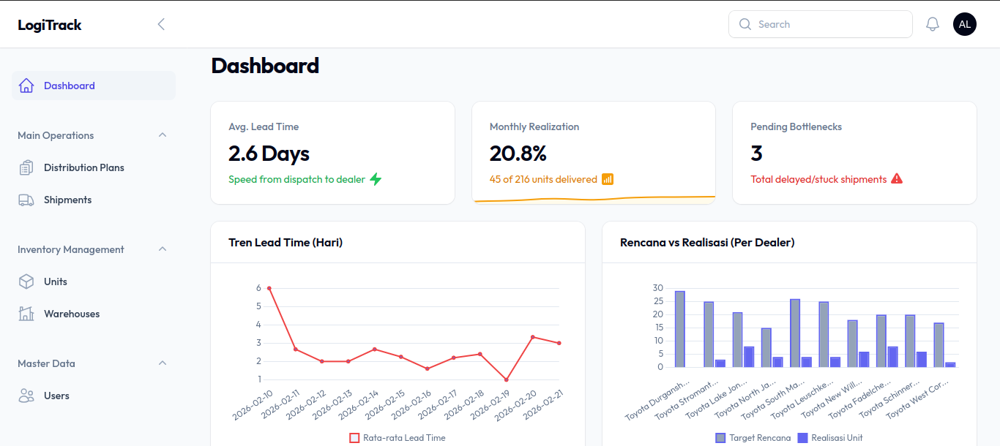
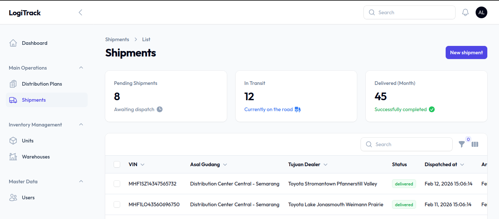
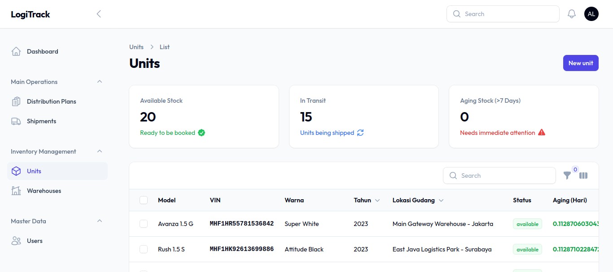
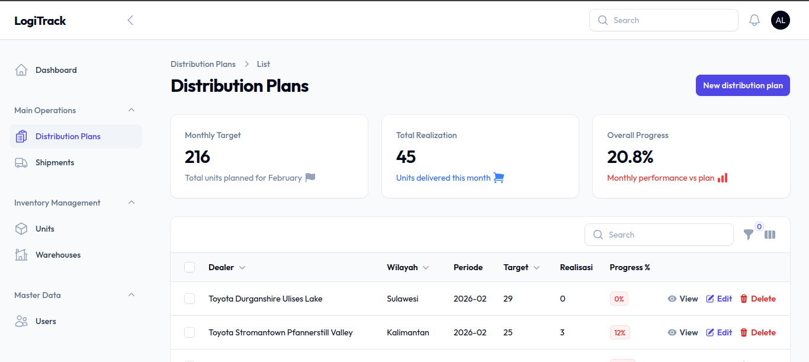
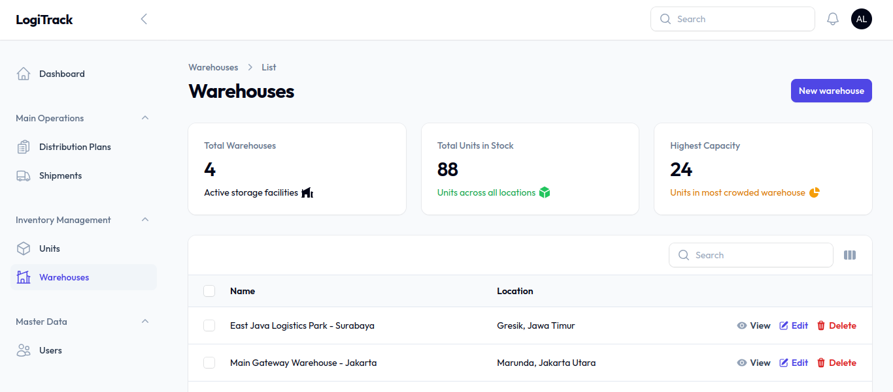
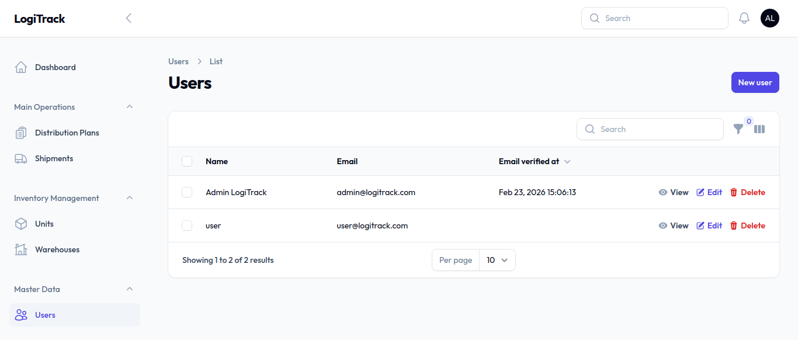

# 🚛 LogiTrack: Smart Distribution Monitoring System

**LogiTrack** adalah platform manajemen logistik dan pemantauan distribusi unit kendaraan tingkat lanjut yang dirancang untuk memberikan transparansi penuh, efisiensi operasional, dan deteksi dini masalah (_bottleneck_) dalam rantai pasokan.

---

## 📸 Project Previews

|  |  |  |
| :--------------------------------------------------: | :---------------------------------------------------: | :--------------------------------------------: |
|                 **Dashboard Utama**                  |                 **Lacak Pengiriman**                  |               **Manajemen Unit**               |

|  |  |  |
| :-------------------------------------------------------------: | :------------------------------------------------: | :---------------------------------------------: |
|                     **Rencana Distribusi**                      |                 **Gudang Lokasi**                  |               **Manajemen User**                |

---

## ✨ Fitur Utama (Value Proposition)

### 📊 1. Dashboard Command Center

Pusat kendali eksekutif untuk melihat kesehatan distribusi secara real-time.

- **KPI Monitoring**: Lead time rata-rata, persentase realisasi bulanan, dan jumlah bottleneck aktif.
- **Visual Analytics**: Grafik perbandingan rencana vs realisasi per dealer, tren kecepatan pengiriman 30 hari terakhir, dan sebaran regional.
- **Status Pulse**: Grafik doughnut yang menampilkan distribusi status unit (Pending, In Transit, Delivered, Delayed).

### 🚨 2. Intelligent Bottleneck Detector

Secara proaktif mengidentifikasi unit yang terhambat dalam perjalanan.

- Filter otomatis untuk unit yang tidak bergerak lebih dari 3 hari.
- Notifikasi visual pada tabel untuk intervensi cepat tim operasional.

### 🔍 3. Global Search & VIN Tracking

Kemudahan mencari data tanpa navigasi rumit.

- Cari Unit, Dealer, atau Status Pengiriman hanya dengan mengetik **Nomor Rangka (VIN)** di Top Bar.
- Tracking history lengkap untuk setiap unit dari masuk gudang hingga diterima dealer.

### 🏗️ 4. Inventory Management & Aging

- **Multi-Warehouse Support**: Kelola stok di berbagai lokasi gudang asal.
- **Stock Aging**: Hitung otomatis berapa lama unit mengendap di gudang untuk mencegah stok lama (_dead stock_).

### 🔐 5. Role-Based Access Control (RBAC)

Keamanan data yang ketat dengan role khusus:

- **Super Admin**: Akses penuh sistem.
- **Manager Logistics**: Akses monitoring dan laporan.
- **Warehouse Staff**: Input data unit dan pengiriman.

---

## 🛠️ Tech Stack

- **Framework**: Laravel 11
- **Admin Panel**: Filament v3 (TALL Stack)
- **Database**: MySQL
- **UI/UX**: Tailwind CSS & HeroIcons
- **Features**: Database Notifications, Global Search, Export to Excel.

---

## ⚙️ Cara Menjalankan Project (Untuk Developer)

1. Clone repository:
    ```bash
    git clone https://github.com/username/logitrack.git
    ```
2. Install dependencies:
    ```bash
    composer install && npm install && npm run build
    ```
3. Setup Environment:
    ```bash
    cp .env.example .env
    php artisan key:generate
    ```
4. Migrasi & Seed Data:
    ```bash
    php artisan migrate --seed
    ```
5. Jalankan server:
    ```bash
    php artisan serve
    ```

---

dikembangkan dengan ❤️ untuk Solusi Logistik Modern.
